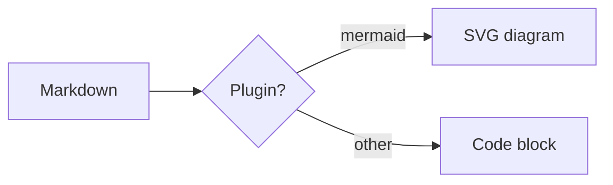
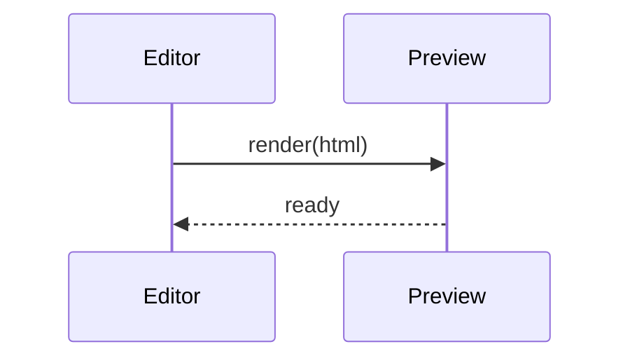

# Mermaid diagrams

```mermaid
flowchart LR
    A[Markdown] --> B{Plugin?}
    B -->|mermaid| C[SVG diagram]
    B -->|other| D[Code block]
```

```mermaid
sequenceDiagram
    Editor->>Preview: render(html)
    Preview-->>Editor: ready
```

An invalid diagram:

```mermaid
flowchart LR
    A --> 
```
